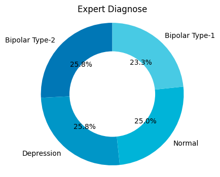
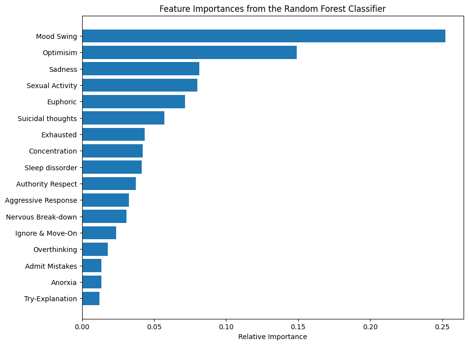
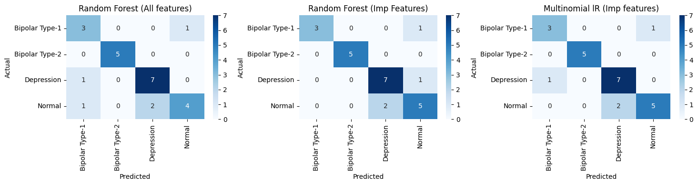

# Mental Disorder Prediction using Machine Learning
## Overview

This project predicts mental health disorders using behavioral and psychological indicators. Early detection of mental disorders is crucial for providing timely care and preventing harmful consequences.

We compare two machine learning models:

* Random Forest Classifier (RF)

* Multinomial Logistic Regression (LR)

with a focus on recall, since missing a patient (false negative) can be harmful in clinical applications.

---

## Dataset
- **Source:** Kaggle - [Mental Disorders Dataset](https://www.kaggle.com/mdsultanulislamovi/mental-disorders-dataset)  
- **Records:** 120 patients  
- **Features:** 17 behavioral/psychological indicators  
- **Target Variable:** `Expert Diagnose` (0: Bipolar Type-1, 1: Bipolar Type-2, 2: Depression, 3: Normal)  

---

## Project Structure

```bash
mental-disorder-prediction/
│
├── data/
│   ├── processed_mental_disorders_dataset.csv        # processed dataset
│   └── X_preprocessed.csv
│   └── y_preprocessed.csv
│
├── notebooks/
│   ├── 01_data_exploration.py          # EDA, visualizations
│   ├── 02_feature_encoding.py          # Feature preprocessing
│   └── 03_model_training.py            # Random Forest & Logistic Regression models
│
├── src/
│   ├── kaggle_data.py                     # data extraction from kaggle
│   ├── data_preprocessing.py              # Functions for data cleaning and encoding
│   ├── feature_selection.py               # Functions for feature importance
│   └── model_training.py                  # Functions to train & evaluate models
│
├── reports/
│   ├── figures/                            # Plots: pie charts, feature importance, confusion matrices
│   └── classification_reports.md           # Classification reports & metrics
│
├── requirements.txt                        # Python dependencies
```

## 1. Exploratory Data Analysis (EDA)

Class Distribution:

Most patients are Depression or Normal, fewer in Bipolar categories.

Visual inspection helps understand dataset balance.



Feature Distribution Example:

Behavioral features vary across classes and can help discriminate between disorders

## 2. Feature Selection

Used Random Forest feature importance.

1. Selected features with importance > 0.05 for model efficiency.

2. Important Features: Sadness, Euphoric, Exhausted, Sleep disorder, Optimism, etc.

Feature Importance Plot:



The selected features maintain strong predictive power while reducing noise.

## 3. Model Comparison
### Random Forest (Important Features)

1. Accuracy: 0.83

2. Macro F1-score: 0.85

3. Strengths: High recall for critical classes (Bipolar Type-1 and Normal).

### Multinomial Logistic Regression (Important Features)

1. Accuracy: 0.83

2. Macro F1-score: 0.84

3. Strengths: Simple linear model, interpretable coefficients.

4. Weakness: Slightly lower recall for critical classes.

## 4. Model Insights

1. Random Forest performs better in minimizing false negatives, critical in healthcare applications.

2. Logistic Regression performs comparably overall, but may miss some critical cases.

3. Feature Importance helps identify which symptoms contribute most to predictions.

4. Balanced Evaluation: Using macro F1-score ensures fair assessment across all classes.


